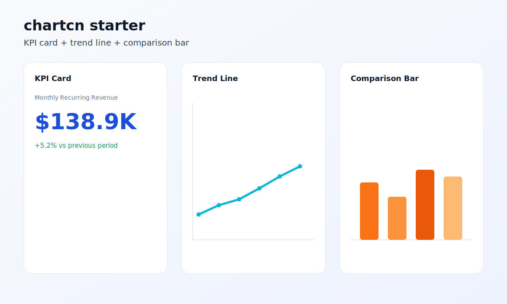

# chartcn-mobile

[](https://github.com/theamodhshetty/chartcn-mobile/actions/workflows/ci.yml)
[](https://github.com/theamodhshetty/chartcn-mobile/actions/workflows/release.yml)
[](LICENSE)

A reusable chart system for mobile apps, inspired by the DX of shadcn/ui.

`chartcn-mobile` does not replace chart engines. It standardizes:

- chart specification (`ChartSpec`)
- data adapters (SwiftData, Room, SQLDelight, API)
- shared theming tokens
- accessibility defaults
- chart interaction defaults (selection + tooltip summaries)
- viewport performance guardrails (windowing + downsampling)
- reusable chart recipes

## Why

Teams repeatedly rebuild the same mobile chart surfaces: KPI cards, trend lines, segmented bars, and dashboard widgets. This project provides a consistent, open-source foundation for iOS and Android.

## Exact User And Promise

- User: mobile teams using SwiftUI + Compose dashboards.
- Promise: Ship production charts from ChartSpec in under few minutes.

## Core Principles

1. Adopt existing chart engines (`Swift Charts`, Compose chart libs) and add a thin reuse layer.
2. Keep `ChartSpec` declarative, versioned, and portable.
3. Make data-source wiring explicit and testable.
4. Ship accessibility and governance from day one.

## Repo Layout

- `packages/spec`: JSON Schema and typed model for `ChartSpec`.
- `packages/ios-swiftui`: iOS integration scaffold for SwiftUI + SwiftData.
- `packages/android-compose`: Android integration scaffold for Compose + Room.
- `registry`: reusable chart recipes.
- `examples`: end-to-end demo app docs.
- `docs`: architecture, spec guide, and project management docs.

## Quick Start

```bash
pnpm chartcn:init
```

Runs directly from repo source. No separate install step for first run.

No prompts. No flags. No first-run choices.

Generated output:

- `chartcn-starter/templates/kpi-card/chartspec.json` (one example spec)
- `chartcn-starter/screenshots/chartcn-starter-preview.svg` (one screenshot output)
- iOS + Android + sample data files for each starter template



Install from npm (preferred, once `NPM_TOKEN` is configured and a publish runs):

```bash
npm install @chartcn/spec
```

Install from GitHub release tarball (available now):

```bash
npm install https://github.com/theamodhshetty/chartcn-mobile/releases/latest/download/chartcn-spec-latest.tgz
```

Enable automated npm publish:

```bash
gh secret set NPM_TOKEN --repo theamodhshetty/chartcn-mobile
```

## Starter Templates (Only 3)

1. `kpi-card`
2. `trend-line`
3. `comparison-bar`

Each template includes:

- `chartspec.json`
- `sample-data.json`
- `ios.swift`
- `android.kt`

## Using It

1. Pick a starter registry item from `registry/dashboards`.
2. Resolve it to a concrete spec:

```bash
pnpm spec:resolve registry/dashboards/trend-line.chart.json --output ./my-chart.json
```

3. Load the spec in your platform package:
- iOS: `ChartSpecLoader.load(...)` + `ChartCNView(spec:rows:)`
- Android: `ChartSpecParser.parse(...)` + `ChartCNView(spec, rows)`

## Spec Tooling

- `pnpm spec:validate`: schema + semantic checks on specs.
- `pnpm spec:validate:registry`: validates registry entries and resolved source specs.
- `pnpm spec:resolve -- <registry-item.json> --output <resolved.json>`: resolves registry entry to a concrete spec.
- `pnpm spec:migrate -- <file.json> --in-place`: migrates spec to current runtime version.
- `pnpm spec:compat -- <baseline.json> <candidate.json>`: compatibility gate check.
- `pnpm spec:bench -- --iterations 200 --rows 1000`: runs benchmark harness for validate/migrate/compat flows.
- `pnpm spec:build`: builds distributable `@chartcn/spec` artifacts into `packages/spec/dist`.

## Status

Active MVP implementation.

See:
- `ROADMAP.md` for milestones.
- `GOVERNANCE.md` for roles and decision model.
- `docs/versioning.md` for spec versioning/migration.
- `docs/performance.md` for benchmark harness and baseline capture.
- `docs/release-strategy.md` for OSS release process.
- `docs/go-to-market.md` for launch and adoption plan.
- `docs/announcement-template.md` for future release announcements.
